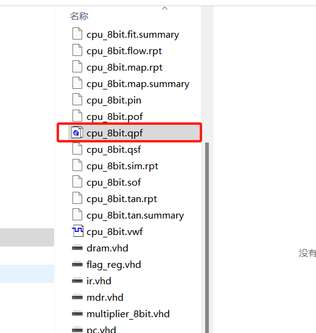
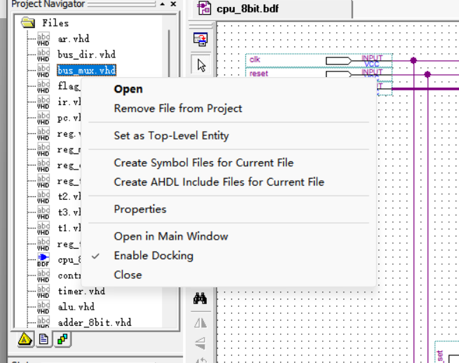
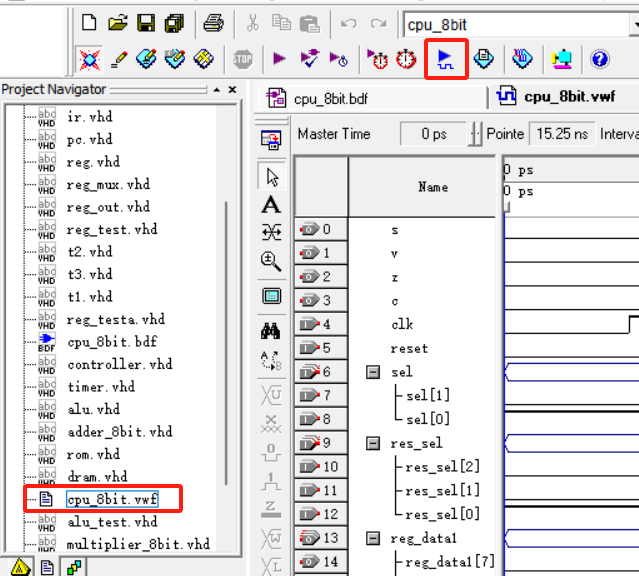
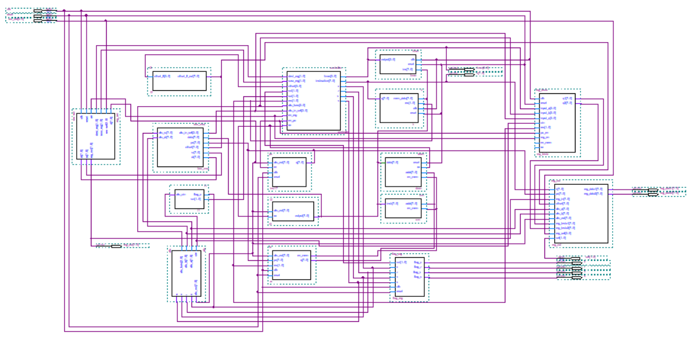

# 计算机组成原理课设

[TOC]

## 实验要求

（一）实验类型：验证性+设计性
（二）实验类别：综合性专业基础实验
（三）实验学时数：8学时
（四）实验目的
理解和验证参考代码，并在其基础上，通过适当改造，尝试设计一个简单的CPU，并测试其结果。
### （五）实验内容
设计一个能验证计算机CPU工作原理的实验系统，包括取指部分、指令译码部分、执行部分、通用寄存器组以及存储器，并测试其结果。
### （六）实验要求
     根本目标：缩小到8位的数据通路，也即是4位OP和4位的地址码。（参考代码是16位数据通路，也即8位OP和8位的地址码）
(参见实践报告.doc中的9-11页的指令系统总体说明)
学生按照实验要求，在实验平台上实现具有存储与运算功能的计算机系统，并能通过测试，以验证其正确性。具体要求如下：
（1）取指及调试(组长兼任)。
熟悉指令取指过程，并把16位的部分改为8位。使用DebugController和系统中的调试模块(reg_testa.vhd，reg_test.vhd)。
（2）熟悉电原理图的连接，以通用寄存器组部分为例。
实现上，用实验4所用的简单通用寄存器组（4个寄存器+1个2-4译码器+2个4选1多路开关）设计方法，替代参考代码中的通用寄存器组部分。
（3）学习和掌握控制逻辑。
设计一套指令集（可在原参考代码指令集的基础上做删减，从中选取16条基本的指令），并修改控制器中指令集的译码部分。
（4）执行部件，ALU的改造。
可在原参考代码的基础上，改变某些运算功能的实现方式，比如加、减、增1、减1等算术运算。
原参考代码采用了最少编码量的“+”、“-”号实现。可以改用通过实验2port map语句调用系统自带的加法器，也可以进一步自己编写加法器，然后用port map语句调用。
（5）存储器部分的加入。
原参考代码采用的带外部存储器的模式。实现上，可以在实验3的基础上，设计一个适合加到本CPU系统的存储器部分，通过与原参考代码系统连接外带存储器的数据线、控制线和地址线相连接。
此部分设计中，存储器的指令置入是一个难点。可以先考虑简单点的作为只读模式把指令写死在存储器中（可用于验证指令的执行）。存储器模块单独调试可行后再加到系统上。

附加可选改造（改造越多分数越高）：
（1）存储器可以尝试在reset的那一拍里，实现存储器中指令的写入。
（2）在原通路中增加DR（数据缓冲寄存器），同时修改指令的执行周期节拍（需要多两拍来将指令打入DR和将数据打入DR）。实现上，为了避免和目标寄存器DR信号混淆，数据缓冲寄存器可以用MDR表示。
（3）存储器分代码段和数据段。
（4）存储器改造成数存和指存，需要修改较多。
（5）其他自己选择的改造。

（七）实验设备
TEC-CA组成原理实验箱。

## 工程文件解释

因为工程文件数量过大，所以只能选取部分代码。

1. 安装好程序后，双击cpu_8bit.qpf即可打开工程文件。

2. 右键vhd代码选择`Create Symbol Files for Current File` 即可获得各个组件（一定要确保所有组件都编译过一次再编译工程文件）

3. 波形图文件 `vwf` 已经配置好，点击上方按钮即可生成仿真结果

- 注意，该课设的 `MULT` 指令和 `LRDD` 指令的输出结果是不符合预期的，可以试着修一下这个BUG

电路图参上
